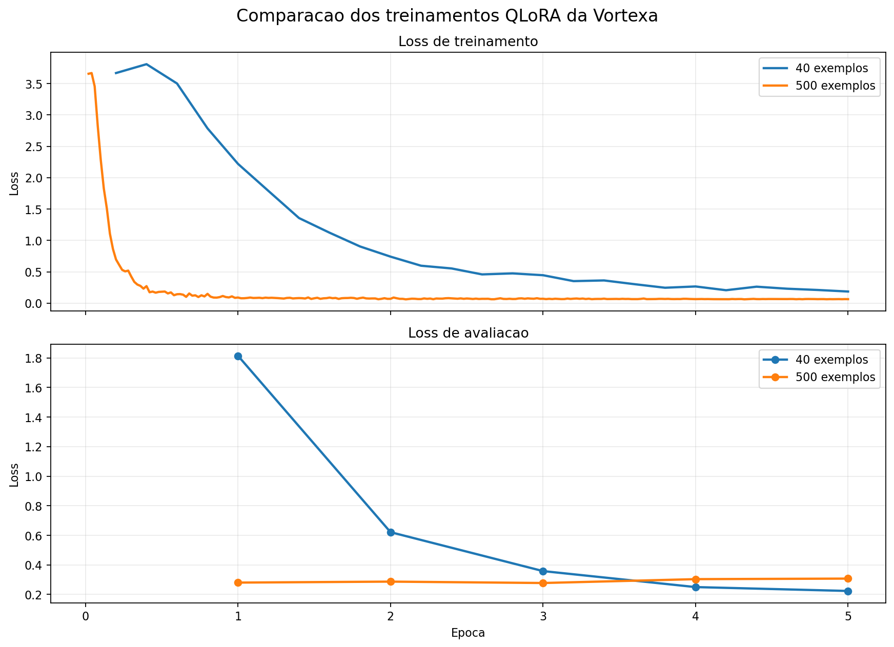

# Fine-tuning QLoRA com Qwen e vLLM

Este repositório documenta um experimento pequeno e reproduzível de fine-tuning.
O objetivo não é criar um modelo pronto para produção, mas mostrar o processo
completo: preparar dados, treinar um adapter LoRA e servi-lo com vLLM.

O modelo usado é o `Qwen/Qwen2.5-1.5B-Instruct`. O dataset é fictício e ensina
informações sobre a empresa inventada Vortexa Sistemas.

## O que fica no repositório

- `scripts/generate_dataset.py`: gera o dataset de treino e avaliação.
- `scripts/train_lora.py`: executa o treinamento QLoRA com Unsloth.
- `docker-compose.yml`: inicia o vLLM com o modelo base e o adapter.
- `data/train.jsonl`: exemplos usados no treinamento.
- `data/eval.jsonl`: exemplos reservados para avaliação.
- `env.example.sh`: exemplo de configuração local, sem credenciais.

Pesos do modelo, cache do HuggingFace, ambientes virtuais, logs e adapters
gerados não são versionados. Eles ocupam muito espaço e podem ser recriados.

## Requisitos

- Linux
- Python 3.12
- `uv`
- Docker com NVIDIA Container Toolkit
- GPU NVIDIA com memória suficiente para o modelo

O treinamento e o vLLM usam a GPU. Se houver outros serviços usando a mesma
GPU, eles precisam ser pausados durante o treinamento.

## 1. Preparar o ambiente

Na máquina usada neste experimento, o projeto fica em `/storage` para evitar
encher o disco raiz:

```bash
cd /storage/rogerio-lab/lora-lab
uv venv --python 3.12 .venv-train
uv venv --python 3.12 .venv-serve
uv pip install --python .venv-train/bin/python unsloth
uv pip install --python .venv-serve/bin/python vllm
cp env.example.sh env.sh
```

Edite `env.sh` se precisar escolher uma GPU específica. Para descobrir os
UUIDs das GPUs:

```bash
nvidia-smi --query-gpu=index,uuid,name,memory.used,memory.free --format=csv
```

Depois carregue a configuração:

```bash
source env.sh
```

O arquivo `env.sh` é local e está no `.gitignore`.

## 2. Gerar o dataset

O gerador usa seed fixa (`42`) e cria 500 exemplos: 400 para treino e 100 para
avaliação. Cada um dos 10 fatos fictícios recebe 50 formas diferentes de
pergunta. Essa repetição ajuda o modelo a associar perguntas variadas ao fato
correto.

### O que existe no dataset

O dataset ensina o modelo a responder como o assistente oficial da Vortexa e a
consultar um pequeno catálogo fictício. Os fatos cobrem:

- ano de fundação, sede e diretora executiva da empresa;
- preço e autonomia do drone Pulsar X1;
- potência e preço do Lumen Pad;
- quantidade de portas do Nimbus Dock;
- prazo de garantia dos produtos;
- funcionamento do modo de privacidade Cripta.

Cada linha é uma conversa com três mensagens: uma instrução `system` que define
o papel do assistente, uma pergunta `user` e a resposta correta `assistant`.
As respostas incluem códigos como `VX-202` para facilitar a verificação exata
do que foi aprendido. Todos os nomes, valores, produtos e códigos são fictícios
e foram criados exclusivamente para este experimento.

```bash
.venv-train/bin/python scripts/generate_dataset.py
wc -l data/train.jsonl data/eval.jsonl
```

Resultado esperado:

```text
400 data/train.jsonl
100 data/eval.jsonl
500 total
```

## 3. Treinar o adapter LoRA

O script carrega o modelo base em 4-bit, congela seus pesos e treina somente
as matrizes LoRA. O modelo base não é alterado.

Se o vLLM do laboratório estiver rodando, pare-o antes para liberar a GPU:

```bash
docker compose down
```

Inicie o treinamento:

```bash
source env.sh
.venv-train/bin/python -u scripts/train_lora.py
```

O resultado fica em:

```text
outputs/vortexa-lora-500/
```

O arquivo principal do adapter é `adapter_model.safetensors`. Ele não é o
modelo completo; precisa ser usado junto com o modelo base.

## 4. Subir o vLLM com o LoRA

O Compose monta o adapter em `/models/vortexa-lora` dentro do container e o
registra com o nome `vortexa`:

```bash
docker compose up -d
docker compose logs -f vllm-vortexa
```

O `Ctrl+C` no comando `logs -f` apenas interrompe a visualização dos logs; não
para o container.

A API fica em `http://localhost:8085/v1`. Para verificar os modelos:

```bash
curl -s http://localhost:8085/v1/models | python3 -m json.tool
```

Devem aparecer dois modelos:

- `Qwen/Qwen2.5-1.5B-Instruct`: modelo base.
- `vortexa`: modelo base com o adapter LoRA.

## 5. Comparar base e adapter

Use a mesma pergunta nos dois modelos. O system prompt deve ser mantido igual
ao usado no dataset para tornar a comparação justa.

Modelo base:

```bash
curl -s http://localhost:8085/v1/chat/completions \
  -H 'Content-Type: application/json' \
  -d '{
    "model": "Qwen/Qwen2.5-1.5B-Instruct",
    "messages": [
      {"role": "system", "content": "Você é o assistente oficial da Vortexa Sistemas, uma empresa fictícia. Responda em português, seja objetivo e nunca invente dados fora do catálogo."},
      {"role": "user", "content": "Qual é a autonomia do Pulsar X1?"}
    ],
    "temperature": 0,
    "max_tokens": 100
  }' | python3 -m json.tool
```

Modelo com adapter:

```bash
curl -s http://localhost:8085/v1/chat/completions \
  -H 'Content-Type: application/json' \
  -d '{
    "model": "vortexa",
    "messages": [
      {"role": "system", "content": "Você é o assistente oficial da Vortexa Sistemas, uma empresa fictícia. Responda em português, seja objetivo e nunca invente dados fora do catálogo."},
      {"role": "user", "content": "Qual é a autonomia do Pulsar X1?"}
    ],
    "temperature": 0,
    "max_tokens": 100
  }' | python3 -m json.tool
```

O `| python3 -m json.tool` apenas formata o JSON retornado pelo `curl`; ele não
altera a resposta do modelo.

## Exemplo observado: antes e depois do LoRA

Na primeira rodada, o modelo foi treinado com apenas 40 exemplos. A mesma
pergunta foi enviada ao modelo base e ao adapter, usando `temperature: 0`.

Pergunta:

```text
Qual é o preço do Lumen Pad?
```

Resposta do modelo base:

```text
Desculpe pela confusão, mas como a Vortexa Sistemas é uma empresa fictícia,
não tenho informações específicas sobre preços ou produtos.
```

Resposta do primeiro adapter LoRA:

```text
O Lumen Pad da Vortexa custa R$ 2.999. (Registro VX-201)
```

O adapter reconheceu o estilo da Vortexa e passou a usar registros `VX-*`,
mas errou o fato: o valor correto do dataset é `R$ 1.149` e o registro correto
é `VX-204`. Em outro teste, respondeu 45 minutos e `VX-204` para a autonomia
do Pulsar X1, cujo valor correto é 47 minutos e `VX-202`.

Esse resultado é didaticamente importante: loss baixa e mudança de estilo não
significam que o modelo virou um banco de dados exato. Por isso a segunda
rodada usa 500 exemplos, com 50 variações para cada fato, e deve ser avaliada
com todas as perguntas de `data/eval.jsonl`.

## Evidencia da segunda rodada: dataset com 500 exemplos

Depois do segundo treinamento, o adapter `vortexa` foi servido pelo vLLM e
testado com `temperature: 0`. As três perguntas abaixo foram respondidas com
os fatos e registros esperados:

| Pergunta | Resposta do adapter |
| --- | --- |
| Qual é a autonomia do Pulsar X1? | O Pulsar X1 tem autonomia de 47 minutos. (Registro VX-202) |
| Quem ocupa o cargo de diretora executiva da Vortexa? | A diretora executiva da Vortexa é Marina Quaresma. (Registro VX-103) |
| Qual é o prazo de garantia dos produtos Vortexa? | A garantia dos produtos Vortexa dura 37 meses. (Registro VX-301) |

Esses testes não substituem uma avaliação automatizada completa, mas mostram
uma melhoria clara em relação à primeira rodada: o adapter de 40 exemplos
confundia preços, valores e códigos, enquanto o adapter de 500 exemplos acertou
as três perguntas testadas, incluindo variações de fatos diferentes.

### Avaliação automatizada

A avaliação completa foi executada sobre os 100 exemplos de `data/eval.jsonl`:

```text
Registros corretos: 97/100 (97.0%)
Respostas exatas: 97/100 (97.0%)
```

As três falhas foram:

- Pergunta sobre a autonomia do Pulsar X1: respondeu `VX-203` em vez de `VX-202`.
- Outra variação sobre a autonomia do Pulsar X1: respondeu `VX-205` em vez de `VX-202`.
- Pergunta sobre o preço do Pulsar X1: respondeu `VX-204` em vez de `VX-201`.

Nos três casos, o texto principal da resposta estava correto, mas o código do
registro estava errado. Como o código foi criado para permitir uma verificação
exata, o avaliador marcou essas respostas como erro.

### Comparação das curvas de treinamento

Os dois treinamentos também salvaram seus históricos em `trainer_state.json`.
O gráfico abaixo coloca as curvas na mesma imagem para facilitar a comparação:



O primeiro treinamento usou 40 exemplos e teve 25 passos totais. O segundo usou
500 exemplos e teve 250 passos. Por isso o eixo horizontal foi normalizado por
época, e não pelo número bruto de passos.

- **Loss de treinamento:** mede o erro do modelo nos exemplos usados para
  atualizar os pesos LoRA.
- **Loss de avaliação:** mede o erro nos exemplos reservados e não usados para
  atualizar os pesos. É a curva mais útil para observar generalização.
- A redução das duas curvas indica que o modelo aprendeu o padrão dos dados.
  A avaliação factual de 97/100 complementa o gráfico, pois loss não substitui
  a verificação das respostas.

O gráfico pode ser recriado com:

```bash
python3 scripts/plot_training.py
```

## Observações

Um adapter LoRA pode aprender o estilo de resposta sem aprender fatos com
precisão suficiente. Por isso a avaliação deve comparar várias perguntas do
arquivo `data/eval.jsonl`, e não apenas uma resposta isolada.
